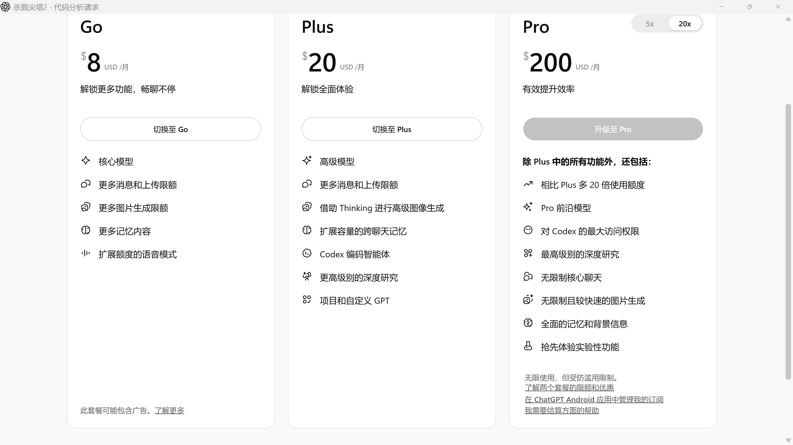
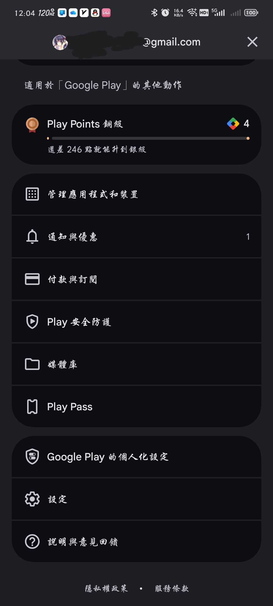
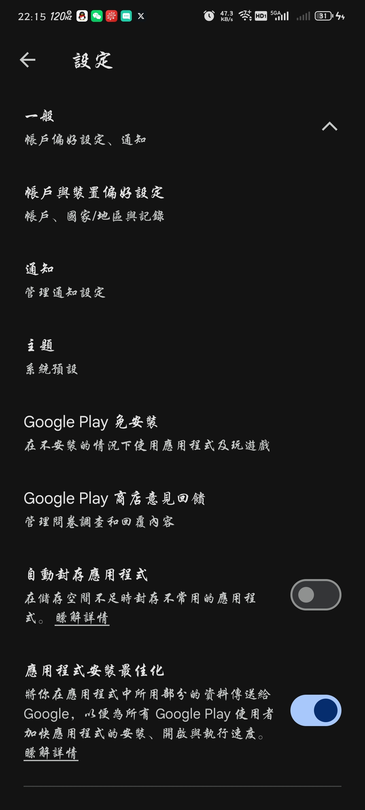
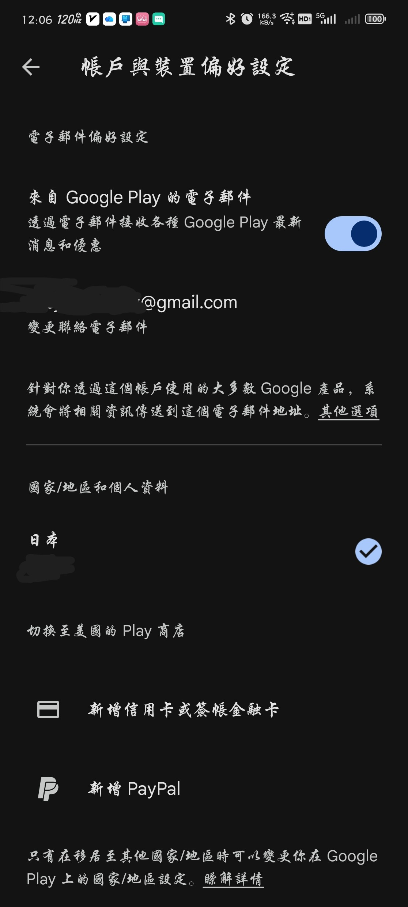
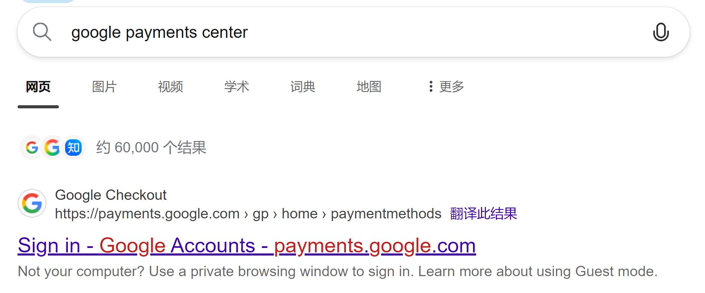
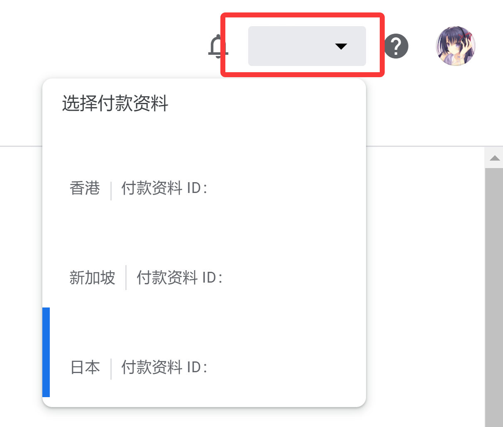
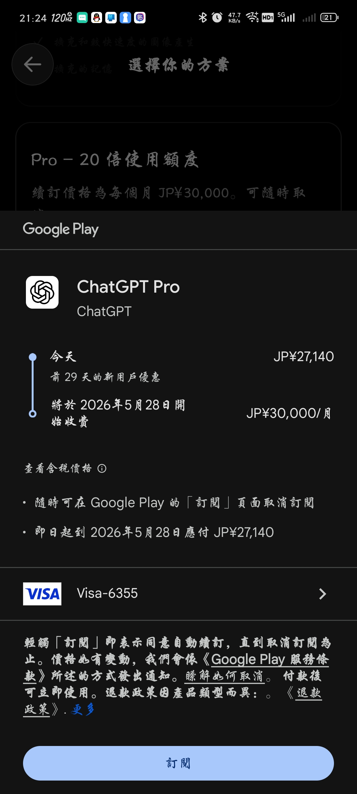
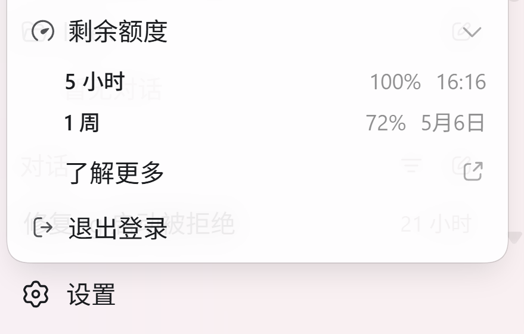

# 教大家如何使用国内Visa卡在官网开通GPT Pro/Plus

## 目录

---
## 0. 前言
### 导语
我个人在22年年底开始用GPT，之前也开过几个月plus，不过都是让朋友帮忙开的，后面GPT越来越不好用就没开了。最近CodeX也是蛮火的，现是嫖了一手免费试用plus（国内卡直接绑PayPal然后官网地区选择德国即可），发现plus额度完全不够用，遂想办法开了个Pro。

> 注意：如果你也有想开Pro的意愿且不想换个号开，不要去领免费plus，因为这会导致你plus生效期间无法通过我们后面的方法升级到Pro，我都只能开在我小号上，后悔死了。

现在市面上的各种广告，要么是那种便宜得要死的，三天两头被封，要么是那种贵得要死的，比美区带税还贵。我们如果有外币卡，完全可以自己动手开。

### 原理
众所周知国内的信用卡直接填到OA上去会被拒绝，因此我们需要通过Google / App Pay转一手（其实上文提到的德区PayPal也是一种方式，还更方便，但是差价太多，不推荐），而手机上是按你的商店地区选择的定价，因此我们需要将商店转移至能够购买的地区
> 不过和某A社比起来，OA简直算是敞开怀抱拥抱中国用户了。

### 准备工具
- 一张国内发行的Visa卡（理论上来讲Master应该也行，但是我没试，不过招行JCB不可用，Master二类借记卡好像也不能绑），如果没有可以自己去申请一个，申请没有什么门槛，很方便。
- 一台安卓手机（我没有苹果设备，苹果的话原理也是类似，还可以买礼品卡之类的，有想要贡献的小伙伴可以在本文的Github页面提交PR补上）
- 你想要转的区的网络

### GPT 档位介绍

GPT大致分为三个档：Plus、Pro 5x、Pro 20x，其中5x版本的Pro在26年5月31日前现实有翻倍的额度，也就是10x。

每档的具体区别此处不再赘述，只是简单说一下价格。日区价格的20刀档位与200刀档位以当前（26年5月2日）的汇率来看分别差不多约合18刀与188刀，而100刀档位则稍贵一点，因此我们这里以日区为例。

> 此外：如果你实在没有Visa或者Master卡，据称谷歌新加坡区可以绑定银联卡，你可以去新加坡买，但是新加坡价格比美区更贵，Plus需要28.98新币（约合22.75刀）。

---
## 1. 检查商店地区
谷歌账号有两个区域，一个是商店区域，一个是服务条款区域，这两个区域不一样，我们这里需要更改的是前者。

首先打开Play商店，点击右上角头像，进入设置，这里可以顺便把Play Points开一下，相当于消费返利1%，我这里忘开了，血亏。

然后点击一般 -> 国家/地区

进去后，如果你已经有过一个付款信息，且IP不一样，他有一个切换至xx的选项，不过你在这里新增是无效的，会显示错误，你可以试试。

---
## 2. 转区
我们搜索google payments center，点进去

进入设置，将国家地区这一栏改为你想去的地方

点击支付方式，在右上角切换付款资料为你需要的那一个，然后增加一个付款方式即可（注意：如果你是转的美区，务必要将地址填写为美国免税州，可以网上随便搜一个免税州生成器）

  
回到Google Play商店，再回到刚刚的那个页面，这时候你会发现你有两个付款资料（假如以前有过付款资料的话），点击你的目的地，会提醒你**90天内不可再转**，切换，然后就可以去GPT付款了。

---
## 3. GPT付款
打开GPT App，点击获取Plus（如果你要开Pro，也要先开Plus然后再升上去，会退差价，不用担心）这里可以点击查看含税价格，如果是美区，这个税额应该是0。

付款成功后，就可以爽用了，我这几天已经用了周额度的 72%，换算到没翻倍的5x里现在应该已经干瞪眼了，不过我觉得一般用户现在100刀的Pro应该也够用，额度是10x，实在不行还能补差价升级。

